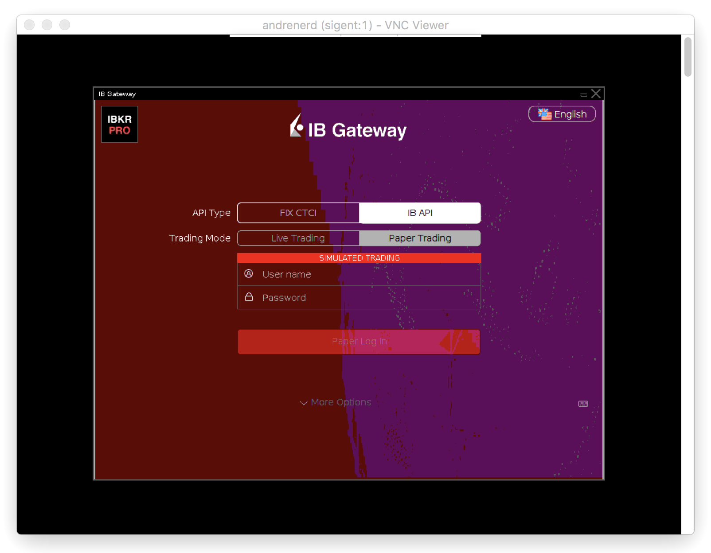

# IBKR Automated Trading Evironment  

  
  
InteractiveBrokers provides couple of tools that can be used to setup environment for trading or signal bots. The first one is the trading terminal itself, [TWS](https://www.interactivebrokers.com/en/index.php?f=14099#tws-software) and the second one is a kind of communicator between bots and the broker, [IBGateway](https://www.interactivebrokers.com/en/index.php?f=5041). 

In case of server side environment, IBGateway supposed to be used. Eventhough it can be easily installed on different systems, including unix-based, such as Ubuntu, it's not fully as a hands-free tool. As there is no command line interface and utils to run it smoothly.  


## Dependencies  

IBGateway reqiures graphical interface. So to emulate it, some tools to be installed first.  


```
# xvfb, as screen simulator
apt install xvfb
  
# x11vnc, as remote access connector for the screen simulator
apt install x11vnc
```

And then on your computer, from where IBGateway will be configured and managed, install any VNC client. There are free ones, for example [VNC Viewer](https://www.realvnc.com/en/connect/download/viewer). So finally you get not only command line, but graphical access to your server.


## Installation  

As all the dependencies are in place and running, its time to install IBGateway itself.

```
# choose location (home directory)
cd ~

# download installation script
wget https://download2.interactivebrokers.com/installers/ibgateway/latest-standalone/ibgateway-latest-standalone-linux-x64.sh

# make it executable
chmod a+x ibgateway-latest-standalone-linux-x64.sh

# run it (on the "Run IB Gateway?" question, answer "No")
sh ibgateway-latest-standalone-linux-x64.sh -c
```

IBGateway version 978 or later needs no extra "wrappers", such as [IBController](https://github.com/ib-controller/ib-controller) or [IBC](https://github.com/IbcAlpha/IBC), to run continuously. Even more, these tools can produce undesibrable effects, if coupled with the new IBG versions.


## Run
```
# screen emulator (press enter twice) 
Xvfb :1 -ac -screen 0 1024x768x24 & 

# remote access connector 
x11vnc -ncache 10 -ncache_cr -display :1 -forever -shared -logappend /var/log/x11vnc.log -bg -noipv6 

# gateway (press enter twice) 
export DISPLAY=:1 
DISPLAY=:1 ~/Jts/ibgateway/978/ibgateway & 

```


<p align="center">  

</p>  

